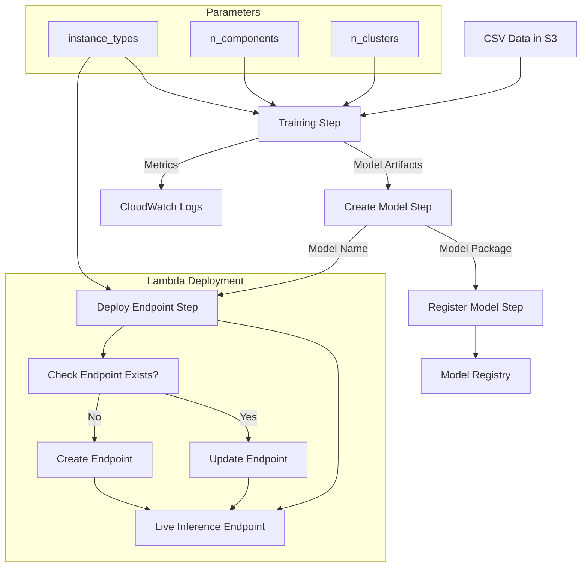
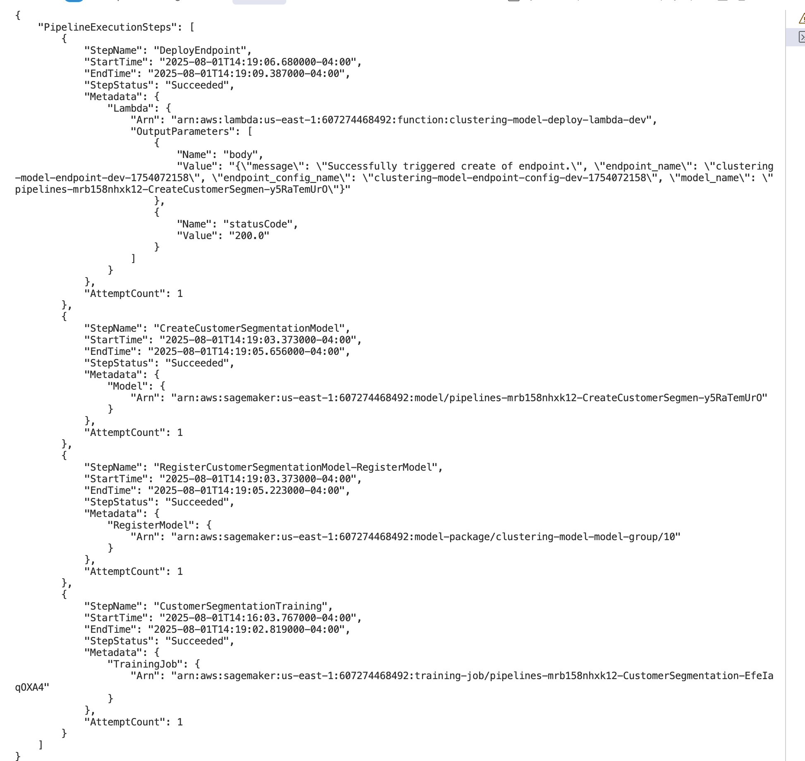

# Customer Segmentation ML Pipeline

Automated ML pipeline for customer clustering using scikit-learn on AWS SageMaker with configurable parameters and automatic deployment.

## 1. Overview

### 1.1 Purpose
ML pipeline for customer clustering using KMeans, PCA, and feature engineering on AWS SageMaker.

### 1.2 Key Features
- **Data Source**: S3-hosted CSV files for training input
- **Metrics Tracking**: Automated clustering quality evaluation
- **Deployment**: Zero-downtime endpoint updates via Lambda
- **Configuration**: YAML-based parameter management
- **CLI Support**: Deploy and run modes for CI/CD integration

## 2. Architecture

### 2.1 Pipeline Flow



### 2.2 Pipeline Components

#### 2.2.1 Input Parameters
- **n_clusters**: Number of customer segments (default: 3)
- **n_components**: PCA components for dimensionality reduction (default: 1)
- **data_file**: Training CSV filename
- **training_instance_type**: Compute for training (default: ml.m5.large)
- **inference_instance_type**: Compute for inference (default: ml.t2.medium)

#### 2.2.2 Pipeline Steps
- **Training Step**: Sklearn clustering with hyperparameter tuning, tracks model quality metrics (silhouette score, Calinski-Harabasz index, Davies-Bouldin index)
- **Model Creation**: Packages trained artifacts with inference code for deployment
- **Model Registration**: Adds model to registry with manual approval status for governance
- **Endpoint Deployment**: Lambda-driven automatic endpoint creation/update with timestamped naming

### 2.3 File Structure
- `train.py` - Training script
- `inference.py` - Model serving
- `preprocessing.py` - Feature engineering
- `pipeline.py` - SageMaker pipeline
- `pipeline_config.yaml` - Set configs including roles, buckets etc.

## 3. Setup and Configuration

### 3.1 Prerequisites
- AWS account with SageMaker access
- Configured AWS CLI credentials
- Python environment with uv package manager

### 3.2 Installation

#### 3.2.1 Install Dependencies
```bash
uv sync
```

#### 3.2.2 Configure Pipeline
Update configuration in `src/pipeline_config.yaml` with your AWS resources:
- S3 bucket names
- IAM roles
- Instance types
- Model parameters

#### 3.2.3 Upload Training Data
```bash
aws s3 cp customer_data.csv s3://{your-bucket}/data/
```

## 4. Usage

### 4.1 Deploy and Run Pipeline

#### 4.1.1 Deploy Pipeline Infrastructure
```bash
uv run python ./src/pipeline.py --action deploy
```

#### 4.1.2 Execute Training Pipeline
```bash
uv run python ./src/pipeline.py --action run
```

### 4.2 Model Inference

#### 4.2.1 Endpoint Creation
The pipeline automatically creates and manages inference endpoints through Lambda functions.

#### 4.2.2 Test Inference
```python
import boto3
import json

# Initialize SageMaker runtime client
runtime = boto3.client('sagemaker-runtime')

# Prepare sample data
data = {
    "Age": 30, 
    "Income": 50000, 
    "Purchases": 10, 
    "Gender": "Male"
}

# Invoke endpoint
response = runtime.invoke_endpoint(
    EndpointName='clustering-model-endpoint',
    ContentType='application/json',
    Body=json.dumps(data)
)

# Parse results
result = json.loads(response['Body'].read())
print(result)
```

## 5. Monitoring and Maintenance

### 5.1 Model Quality Metrics
The pipeline automatically tracks:
- Silhouette score
- Calinski-Harabasz index
- Davies-Bouldin index

### 5.2 Deployment Management
- Zero-downtime endpoint updates
- Timestamped endpoint naming
- Automatic endpoint creation/update logic via Lambda

### 5.3 Model Registry
- Version tracking and model lineage

### 5.4 Pipeline execution Screenshot


